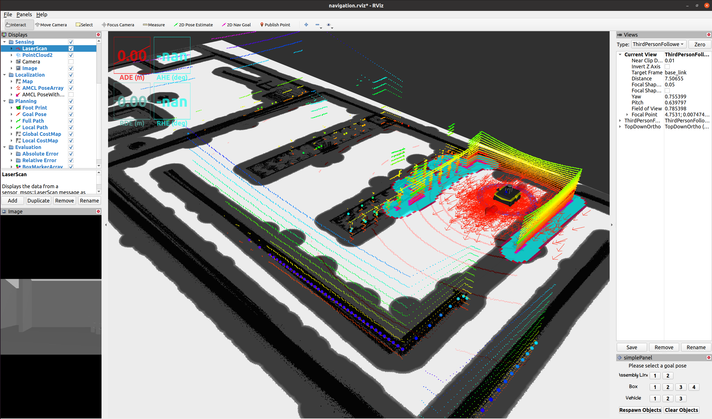
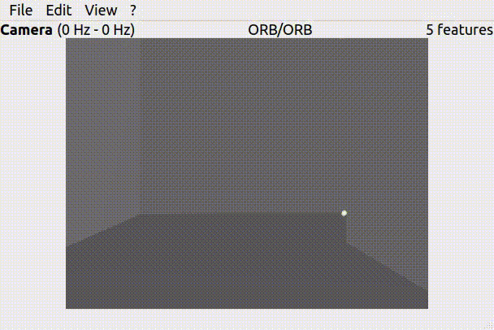

# ME5413_Final_Project

NUS ME5413 Autonomous Mobile Robotics Final Project
> Origin Authors: [Christina](https://github.com/ldaowen), [Yuhang](https://github.com/yuhang1008), [Dongen](https://github.com/nuslde), and [Shuo](https://github.com/SS47816)

> Project Group Members: Yuwei, [Guorong](https://github.com/z492x), [Zihan](https://github.com/Zhouzihan13), Jilun, Mingrui, and [Peiqi](https://github.com/peiqizhao)


## Dependencies

* System Requirements:
  * Ubuntu 20.04 (18.04 not yet tested)
  * ROS Noetic (Melodic not yet tested)
  * C++11 and above
  * CMake: 3.0.2 and above
* This repo depends on the following standard ROS pkgs:
  * `roscpp`
  * `rospy`
  * `rviz`
  * `std_msgs`
  * `nav_msgs`
  * `geometry_msgs`
  * `visualization_msgs`
  * `tf2`
  * `tf2_ros`
  * `tf2_geometry_msgs`
  * `pluginlib`
  * `map_server`
  * `gazebo_ros`
  * `jsk_rviz_plugins`
  * `jackal_gazebo`
  * `jackal_navigation`
  * `velodyne_simulator`
  * `teleop_twist_keyboard`
  * `cv_bridge`
  * `teb_local_planner`
  * `navigation`
  * `find_object_2d`
* And this [gazebo_model](https://github.com/osrf/gazebo_models) repositiory

## Installation

This repo is a ros workspace, containing three rospkgs:

* `add_obstacle_layer` is a plugin to add a custom layer to the costmap
* `interactive_tools` are customized tools to interact with gazebo and your robot
* `jackal_description` contains the modified jackal robot model descriptions
* `me5413_world` the main pkg containing the gazebo world, and the launch files


**Note:** If you are working on this project, it is encouraged to fork this repository and work on your own fork!

After forking this repo to your own github:

```bash
# Clone your own fork of this repo (assuming home here `~/`)
cd
git clone https://github.com/<YOUR_GITHUB_USERNAME>/ME5413_Final_Project.git
cd ME5413_Final_Project

# Install all dependencies
rosdep install --from-paths src --ignore-src -r -y

# Build
catkin_make
# Source 
source devel/setup.bash
```

To properly load the gazebo world, you will need to have the necessary model files in the `~/.gazebo/models/` directory.

There are two sources of models needed:

* [Gazebo official models](https://github.com/osrf/gazebo_models)
  
  ```bash
  # Create the destination directory
  cd
  mkdir -p .gazebo/models

  # Clone the official gazebo models repo (assuming home here `~/`)
  git clone https://github.com/osrf/gazebo_models.git

  # Copy the models into the `~/.gazebo/models` directory
  cp -r ~/gazebo_models/* ~/.gazebo/models
  ```

* [TA‘s customized models](https://github.com/NUS-Advanced-Robotics-Centre/ME5413_Final_Project/tree/main/src/me5413_world/models)

  ```bash
  # Copy the customized models into the `~/.gazebo/models` directory
  cp -r ~/ME5413_Final_Project/src/me5413_world/models/* ~/.gazebo/models
  ```

Install the required packages of navigation and template matching:
```bash
# Install teb_local_planner
sudo apt-get install ros-noetic-teb-local-planner

# Install find_object_2d
sudo apt-get install ros-noetic-find-object-2d
```

## Usage

### 0. Gazebo World

This command will launch the gazebo with the project world

```bash
# Launch Gazebo World together with our robot
roslaunch me5413_world world.launch
```

### 1. Mapping

After launching **Step 0**, in the second terminal:

```bash
# Launch GMapping
roslaunch me5413_world mapping.launch
```

After finishing mapping, run the following command in the thrid terminal to save the map:

```bash
# Save the map as `my_map` in the `maps/` folder
roscd me5413_world/maps/
rosrun map_server map_saver -f my_map map:=/map
```


### 2. Navigation

After completing the mapping task and saving the map, quit all processes and modify the name of the map called in file `navigation_test.launch` accordingly. 

To make sure the script works, you first need to grant permissions to the two Python scripts in the scripts folder：
```bash
# Give permision to the scripts
cd ~/ME5413_Final_Project/src/me5413_world/scripts
chmod +x object_position_publisher.py
chmod +x goal_sequence_generator.py
```

You can now officially run the navigation node, in the first terminal：
```bash
# Launch Gazebo World together with our robot
roslaunch me5413_world world.launch
```


Then, in the second terminal:

```bash
# Load a map and launch AMCL localizer
roslaunch me5413_world navigation_test.launch
```



Robot uses template matching nodes to search and navigate to the target box：




## Contribution

You are welcome contributing to this repo by opening a pull-request

We are following:

* [Google C++ Style Guide](https://google.github.io/styleguide/cppguide.html),
* [C++ Core Guidelines](https://isocpp.github.io/CppCoreGuidelines/CppCoreGuidelines#main),
* [ROS C++ Style Guide](http://wiki.ros.org/CppStyleGuide)


## Acknowledgements
We thank Prof. Marcelo and the teaching assistants for their guidance and assistance. We used a lot of ROS open source code in our project and would like to express our gratitude to their authors.
* [Cartographer](https://github.com/cartographer-project/cartographer): A collection of mapping algorithms implemented in C++ by Google.
* [FAST-LIO](https://github.com/hku-mars/FAST_LIO): A computationally efficient and robust LiDAR-inertial odometry package by hku-mars group.
* [A-LOAM](https://github.com/AtsushiSakai/PythonRobotics): A collection of robotics algorithms implemented in Python.
* [find_object_2d](https://github.com/introlab/find-object): An integrated visual algorithm library for easy object detection.


## License

The [ME5413_Final_Project](https://github.com/NUS-Advanced-Robotics-Centre/ME5413_Final_Project) is released under the [MIT License](https://github.com/NUS-Advanced-Robotics-Centre/ME5413_Final_Project/blob/main/LICENSE)